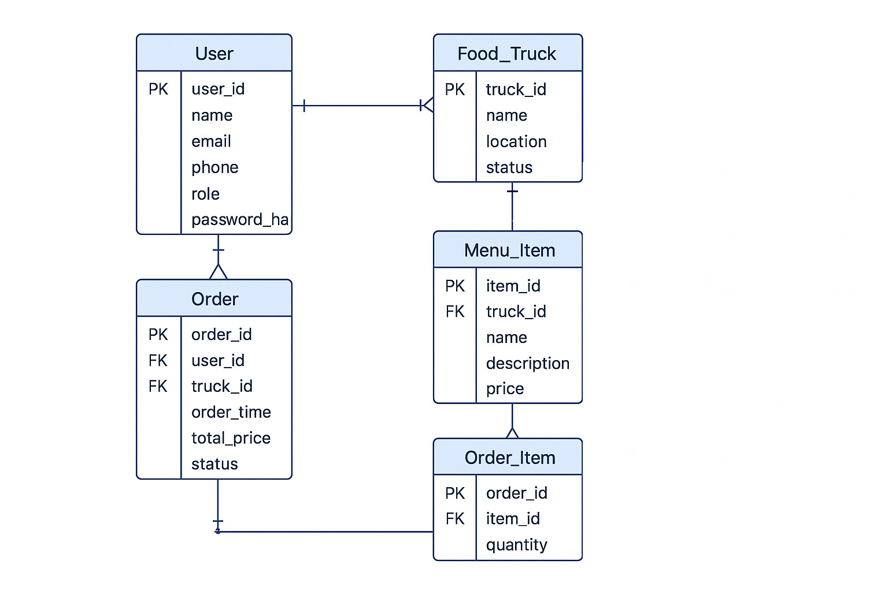
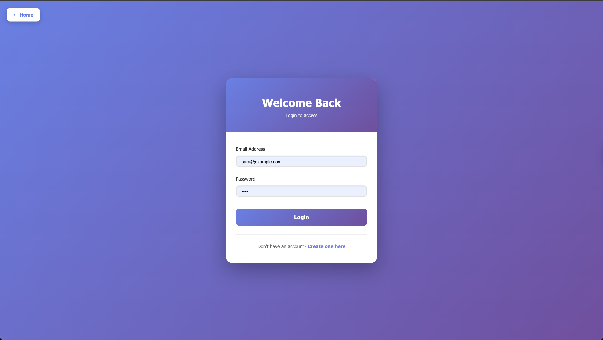
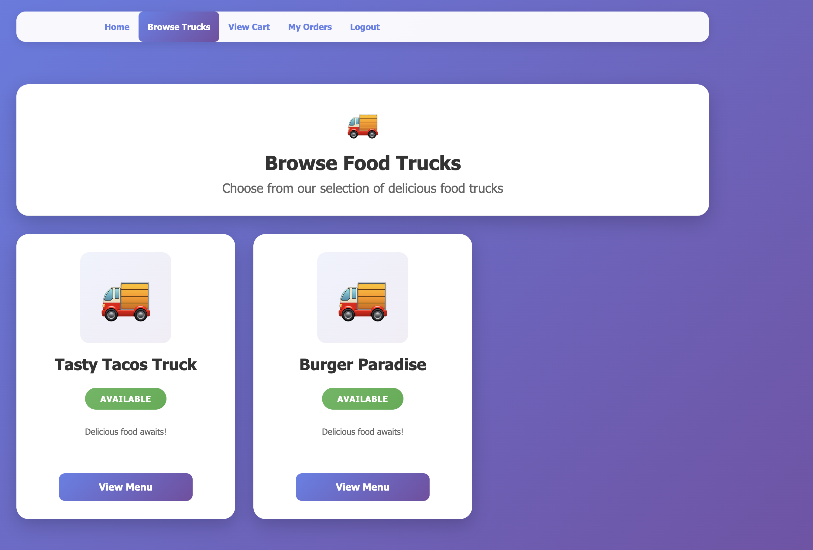
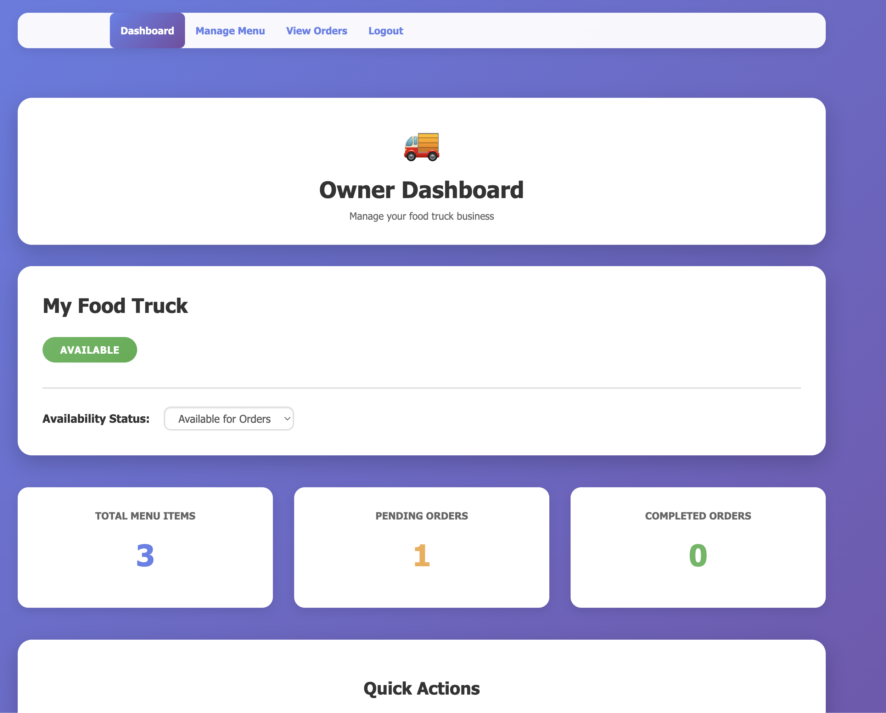
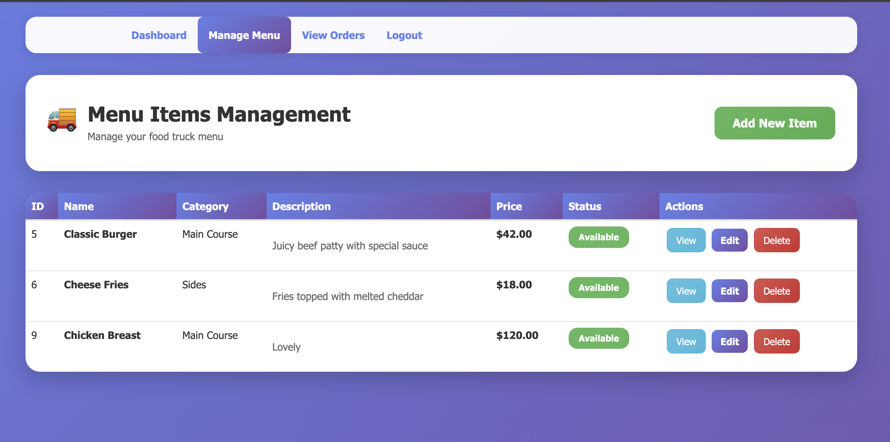
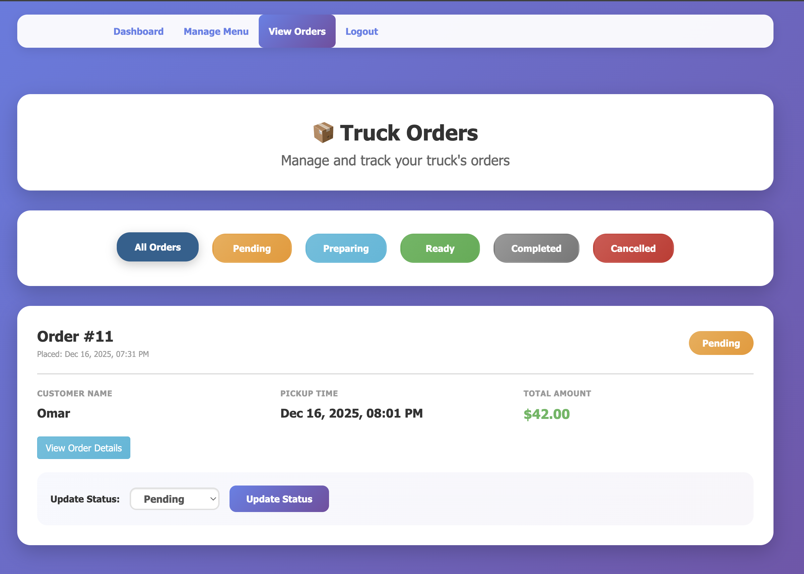
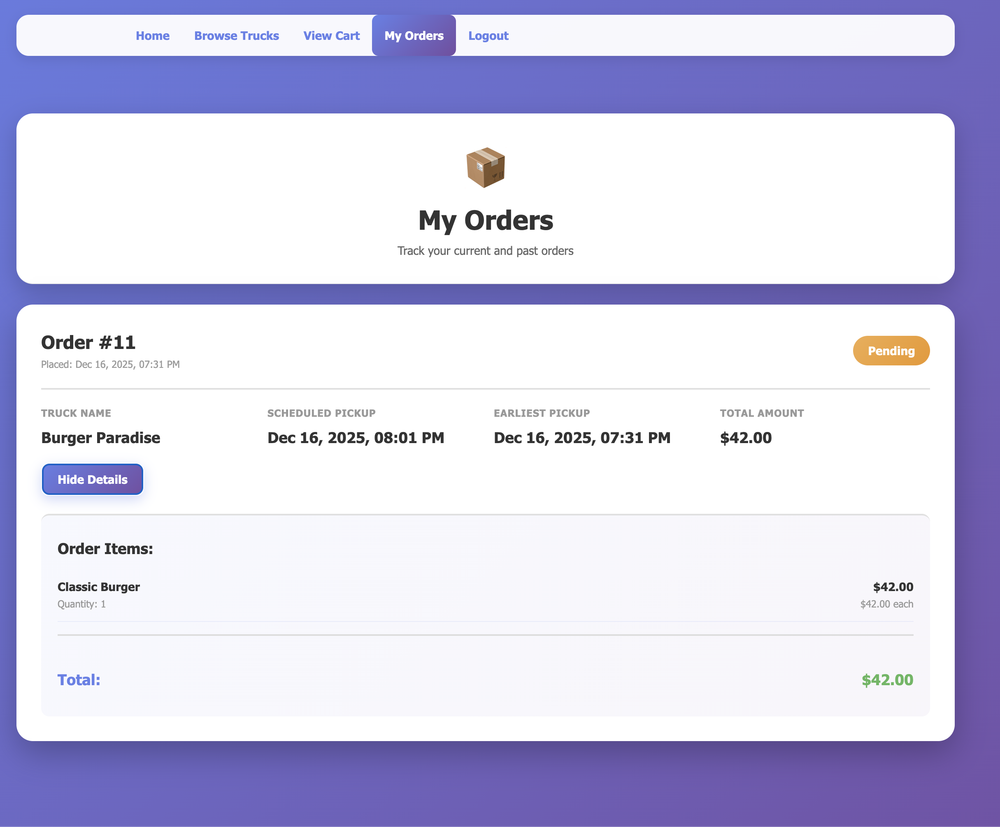

# GIU Food Trucks

## 1. Project Title and Description

### Team Members

| Name | ID | Tutorial |
|------|----|------------|
| Mohamed Tamer      | 13003275 |  |
| Ziad Mohame        | 7003312  |  |
| Antonios morcos    | 13004371 |  |
| Kevin michael      | 13002425 |  |
| Omar ahmed sherif  | 13002837 |  |
| Saged              | 13002815 |  |
| Adam Hamouda       | 16004989 |  |
| Steven joseph      | 13003145 |  |

### Description
GIU Food Trucks is a comprehensive web application that connects food truck owners with customers. The platform enables customers to browse food trucks, view menus, place orders, and track their order status. Food truck owners can manage their menus, update availability, and process orders efficiently.

---

## 2. Features

### Customer Features
- **User Authentication**: Register and login with email/password
- **Browse Food Trucks**: View all available food trucks with their status
- **Menu Browsing**: View detailed menus with categories, descriptions, and prices
- **Category Filtering**: Filter menu items by category
- **Shopping Cart**: Add, update quantities, and remove items
- **Order Placement**: Schedule pickup time and place orders
- **Order Tracking**: View order history with detailed status tracking
- **Order Details**: View complete order information including items and pricing
- **Real-time Status Updates**: Track order status (Pending → Preparing → Ready → Completed)

### Truck Owner Features
- **Owner Dashboard**: View statistics (menu items, Orders States)
- **Availability Management**: Change truck availability for orders (Available/Unavailable)
- **Menu Management**: 
  - Add new menu items
  - Edit existing items
  - Delete items
  - View all menu items in a table
- **Order Management**:
  - View all orders for the truck
  - Filter orders by status (All, Pending, Preparing, Ready, Completed, Cancelled)
  - View detailed order information
  - Update order status

---

## 3. Technology Stack

### Frontend
- **HTML5 & CSS3**: Structure and styling
- **Bootstrap 4**: Responsive design framework
- **jQuery**: DOM manipulation and AJAX requests

### Backend
- **Node.js**: Runtime environment
- **Knex.js**: SQL query builder

### Database
- **PostgreSQL**: Relational database management system

---

## 4. ERD



---

## 5. Installation and Setup

### Prerequisites
- Node.js (v14 or higher)
- PostgreSQL (v12 or higher)
- npm or yarn package manager


### Step 1: Install Dependencies
```bash
npm install
```

### Step 2: Database Setup
1. Open pgAdmin and create a new database
2. Name it `giu_food_trucks` (or your preferred name)

### Step 3: Configure Environment Variables
Create a `.env` file in the root directory:
```env
PORT=3000
PASSWORD=your_postgresql_password
```

### Step 4: Update Database Configuration
Open `/connectors/db.js` and update the database name:
```javascript
const config = {
  client: 'pg',
  connection: {
    host : 'localhost',
    port : 5432,
    user : 'postgres',
    password : process.env.PASSWORD,
    database : 'giu_food_trucks'  // Update this to match your database name
  }
};
```

### Step 5: Create Database Tables
Run the SQL script to create all necessary tables:
- Open `/connectors/scripts.sql` in pgAdmin
- Execute the script in your database

### Step 6: Seed the Database (Optional)
Load sample data for testing:
- Open `/connectors/seed.sql` in pgAdmin
- Execute the script in your database

### Step 7: Start the Server
```bash
npm run server
```

The server will start at `http://localhost:3000/`

### Step 9: Access the Application
Open your browser and navigate to:
- **Homepage**: `http://localhost:3000/`
- **Customer Login**: Use test credentials from Section 6
- **Truck Owner Login**: Use test credentials from Section 6

---

## 6. Test Credentials

### Customer Account
- **Email**: Omar@gmail.com
- **Password**: 1234

### Truck Owner Account
- **Email**: sara@example.com
- **Password**: 1234

---

## 7. Screenshots

### Customer Interface

#### Registration Page


#### Login Page


#### Browse Food Trucks


#### Menu 


### Truck Owner Interface

#### Owner Dashboard


#### Menu Management


#### Order Management


#### Order Details


---

## 8. API Endpoints Summary

### Public Endpoints (No Authentication)
| Method | Endpoint | Description |
|--------|----------|-------------|
| POST | `/api/v1/user` | Register new user |
| POST | `/api/v1/user/login` | User login |

### Customer Endpoints (Authentication Required)
| Method | Endpoint | Description |
|--------|----------|-------------|
| GET | `/api/v1/trucks/view` | View all food trucks |
| GET | `/api/v1/menuItem/truck/:truckId` | Get menu items for a truck |
| GET | `/api/v1/menuItem/truck/:truckId/category/:category` | Filter menu by category |
| GET | `/api/v1/cart/view` | View customer's cart |
| POST | `/api/v1/cart/new` | Add item to cart |
| PUT | `/api/v1/cart/edit/:cartId` | Update cart item quantity |
| DELETE | `/api/v1/cart/delete/:cartId` | Remove item from cart |
| POST | `/api/v1/order/new` | Place new order |
| GET | `/api/v1/order/myOrders` | Get customer's orders |
| GET | `/api/v1/order/details/:orderId` | Get order details |

### Truck Owner Endpoints (Authentication Required)
| Method | Endpoint | Description |
|--------|----------|-------------|
| GET | `/api/v1/trucks/myTruck` | Get owner's truck info |
| PUT | `/api/v1/trucks/updateOrderStatus` | Update truck availability |
| GET | `/api/v1/menuItem/view` | Get all menu items |
| GET | `/api/v1/menuItem/view/:itemId` | Get specific menu item |
| POST | `/api/v1/menuItem/new` | Add new menu item |
| PUT | `/api/v1/menuItem/edit/:itemId` | Update menu item |
| DELETE | `/api/v1/menuItem/delete/:itemId` | Delete menu item |
| GET | `/api/v1/order/truckOrders` | Get all orders for truck |
| GET | `/api/v1/order/truckOwner/:orderId` | Get specific order details |
| PUT | `/api/v1/order/updateStatus/:orderId` | Update order status |

**Total: 22 API Endpoints**

---

## 9. Contributors

| Name               | Contributions |
|--------------------|---------------|
| Mohamed Tamer      | Cart management APIs, Menu browsing frontend, TruckOrder view |
| Ziad Mohamed       | Food truck  API, Menu filtering by category, Order placement backend|
| Antonios morcos    |Order API, Truck availability management |
| Kevin michael      | Order status updates API, Menu item CRUD operations, Owner dashboard Views,|
| Omar ahmed sherif  | Truck owner order management, Menu management View |
| Saged              | AddMenu Views, Truck profile management|
| Adam Hamouda       | Menu item management APIs, Order details view, Customer interface design, Route protection, Security implementation |
| Steven joseph      | Complete Views,Customer order interface |

---
